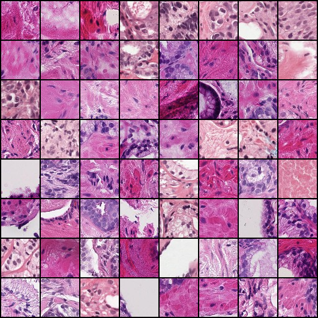

# VAE-for-Medical-Image-Generation

This is a repository for a research project by Duke University students Teo Feliu, Maximilian Holsman, and Emmanuel Mokel. The project aimed to find ways in which we can use Variational Autoencoders (VAEs) to generate high quality medical images. Our full project report can be found [here](https://github.com/maxholsman/VAE-for-Medical-Image-Generation/blob/main/CS_675_Final_Project_Writeup.pdf). 

This project borrowed code from the [PyTorch-VAE repository](https://github.com/AntixK/PyTorch-VAE) and the [VAE-GAN-PYTORCH repository](https://github.com/rishabhd786/VAE-GAN-PYTORCH). 


*Example generation of prostate images trained on the [Prostate Gleason Dataset](https://github.com/MicheleDamian/prostate-gleason-dataset/tree/master)*

# Abstract
Variational Autoencoders (VAEs) (Kingma & Welling, 2022) are a deep generative model used to produce realistic synthetic data in the same theme as training data. Collecting data in a medical context can be a time consuming and expensive task, making it difficult to make predictive and interpretable machine learning models in medical contexts. VAEs can be used to improve the quality of medical image datasets, which may be of low resolution or contain lots of noise. We utilize several VAE variants in order to generate images from several medical datasets. We then train a generator to distinguish synthetic training data created by our VAEs from real medical data, similar to how Generative Adversarial Networks (GANs) work, in order to improve our images. We hope this method can be applied to generate synthetic medical images for real world use, and improve
existing data.

[Full report](https://github.com/maxholsman/VAE-for-Medical-Image-Generation/blob/main/CS_675_Final_Project_Writeup.pdf)

# Usage
## Data Preparation
If using the [Prostate Gleason Dataset](https://github.com/MicheleDamian/prostate-gleason-dataset/tree/master) dataset, download it into `/Data` directory. All MedMNIST images will be downloaded automatically. If you would like to train the VAE to generate images from a custom dataset, modify the `dataset.py` file to create a new Dataset class. You will find examples of other custom datasets classes in the file already.
## Install Requirements
```
$ pip install -r requirements.txt
```
## Train VAE
### For Vanilla VAE and MSSIM VAE
Change desired parameters in config dictionary in `run_reg_vaes.py` and specify desired model. Then run `$ python run_reg_vaes.py`
### For VAE-GAN
Again, change desired parameters in config dictionary in `run_vaegan.py` and run `$ python run_vaegan.py`. 

<!-- 
# Generated Images
| Training Images | Reconstructed Images| Generated Images |
|---------------|------------------|------------------|
|  |  |  | -->

<!-- |  |  |
| ...           | ...              | -->
